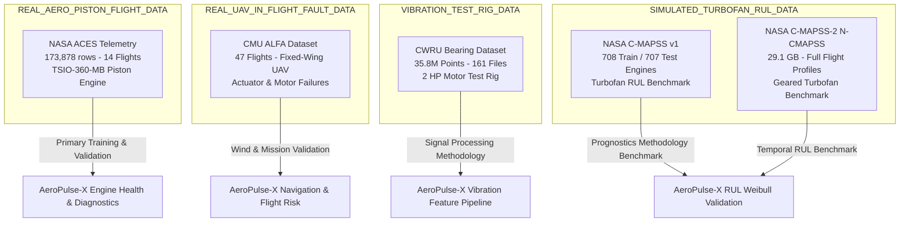

# AEROPULSE-X: COMPREHENSIVE MULTI-DATASET SCIENTIFIC AUDIT
**Deep Forensic Inspection, Physical Grounding, Data Provenance & Architectural Boundary Analysis**
**Document Version**: 1.0.0-AUDIT | **Date**: August 2026

---

## 1. Executive Summary & Inventory of Downloaded Datasets

A systematic forensic audit of all datasets present in the environment was conducted to establish physical provenance, measurement domains, sampling characteristics, and architectural boundaries before any model changes or retraining.

Five distinct dataset repositories were located, verified, and audited:
1. **NASA ACES** (Airborne Clean Air Experiment — Twin-Turbo Aero Piston Engine Flight Telemetry)
2. **NASA C-MAPSS v1** (Commercial Modular Aero-Propulsion System Simulation — Turbofan Run-to-Failure Benchmark)
3. **NASA C-MAPSS-2 / N-CMAPSS** (New Commercial Modular Aero-Propulsion System Simulation — Real Flight Profile Turbofan Degradation)
4. **CWRU Bearing Dataset** (Case Western Reserve University — 2 HP Induction Motor Bearing Vibration Test Rig)
5. **ALFA Dataset** (AIR Lab Failure and Anomaly Dataset — Autonomous Fixed-Wing UAV Flight Telemetry & Actuator Faults)

### Master Dataset Inventory Table

| Dataset Identifier | Physical System / Testbed | Location in File System | Format | Size | Total Files | Total Records / Samples | Sampling Frequency | Provenance Classification |
| :--- | :--- | :--- | :--- | :--- | :--- | :--- | :--- | :--- |
| **NASA ACES** | Aero Piston Engine (Continental TSIO-360-MB Twin-Turbo) | `FINAL_DATASET/ACES/aces_health.csv` | CSV | 116.42 MB | 1 CSV (14 raw TARs in `sih_dataset`) | 173,878 rows (60 columns) | 1 Hz ($\Delta t = 1.0\text{ s}$) | **REAL AERO PISTON FLIGHT DATA** |
| **NASA C-MAPSS v1** | Large Commercial Turbofan (90,000 lbf High-Bypass) | `AeroPulse-Datasets/C-MAPSS/.../CMAPSSData/` | Space-delimited TXT | 46.90 MB | 12 TXT files (FD001–FD004) | 265,038 flight cycles (train: 160,359; test: 104,679) | 1 sample / flight cycle | **SIMULATED TURBOFAN RUL DATA** |
| **NASA C-MAPSS-2 (N-CMAPSS)**| Commercial Turbofan Engine (Geared Turbofan with Transient Flight Profiles)| `AeroPulse-Datasets/C-MAPSS/.../C-MAPSS-2/` | HDF5 (`.h5` inside `.zip`) | 15.81 GB (.zip) / ~29.1 GB raw | 10 `.h5` datasets (DS01–DS08) | Millions of timesteps across hundreds of flights | 1 Hz ($\Delta t = 1.0\text{ s}$ continuous) | **SIMULATED TURBOFAN RUL DATA** |
| **CWRU Bearing** | 2 HP Reliance Electric Induction Motor Test Rig | `AeroPulse-Datasets/CWRU_Bearing_NumPy/Data/` | NumPy `.npz` | 51.48 MB | 161 `.npz` files (4 load conditions) | 35,887,173 vibration points | 12 kHz & 48 kHz | **VIBRATION TEST-RIG DATA** |
| **ALFA Dataset** | CarbonZ T-28 Trojan Autonomous Fixed-Wing UAV | `AeroPulse-Datasets/ALFA/` | ROS `.bag`, Dataflash, CSV | 1.745 GB (.zip) / ~2.8 GB raw | 1,732 CSV files across 47 flights | Hundreds of thousands of multi-topic records | 10 Hz – 50 Hz (ROS topic-dependent) | **REAL UAV IN-FLIGHT FAULT DATA** |

---

## 2. Dataset-by-Dataset Forensic Audit

### 2.1. NASA ACES (Airborne Clean Air Experiment)
- **Physical Apparatus**: Twin-turbocharged 6-cylinder spark-ignited piston engine (Continental TSIO-360-MB, displacement 5.9L / 360 cu. in.) installed on airborne research aircraft.
- **Data Provenance**: **REAL AERO PISTON ENGINE FLIGHT DATA**.
- **Records & Runs**: 173,878 rows across 14 distinct flight missions (`aces1am_2002_191` through `aces1am_2002_242`).
- **Features (60 columns)**:
  - *Engine Core*: `Engine_RPM`, `EGT1`, `EGT2`, `EGT3`, `EGT4`, `CHT`, `Oil_Temp`, `Oil_Pressure`, `MAP_Injector`, `Fuel_Flow`, `Fuel_Throughput`, `Fuel_Pressure`, `Fuel_Pulse_Width`, `Lambda_Injector`, `Injector_Current`.
  - *Turbocharger Subsystem*: `Turbo_RPM`, `HP_Turbo_RPM`.
  - *Electronic Fuel Injection (EFI)*: `EFI_RPM`, `EFI_RPM_MAP`, `EFI_Fuel_Temp`, `EFI_Mixture`, `EFI_Water_Temp`, `EFI_ECU_Temp`, `EFI_O2_2`, `EFI_Fuel_Burn`.
  - *Electrical*: `Alternator_Temp`, `Battery_Current`, `Battery_Voltage`.
  - *Environment / Operational*: `Ambient_Temp`, `Operating_State` (CLIMB, CRUISE, CRUISE_LOW, DESCENT, DESCENT_LOW, GROUND, TAKEOFF), `GPS_Time`.
  - *Statistical Z-Scores & Deviation Residuals*: 21 robust residual z-score channels (`*_rz`), `Robust_Anomaly_Score`, `Robust_Max_Deviation`, `Sensors_Above_2Sigma`, `Sensors_Above_3Sigma`.
- **Target Label**: `Health_State` with 4 classes:
  - `Normal`: 110,753 samples (63.69%)
  - `Watch`: 38,361 samples (22.06%)
  - `Warning`: 21,936 samples (12.62%)
  - `Critical`: 2,828 samples (1.63%)
- **Data Quality**:
  - Missing values: 0 across all core telemetry sensors (only `Battery_Current_rz` is entirely NaN due to constant zero variance in current baseline).
  - Duplicate rows: 0.
  - Sampling: Strictly 1.0 Hz time series.
- **AeroPulse-X Applicability**: **Primary Production Training & Diagnostic Model Ground Truth**.

---

### 2.2. NASA C-MAPSS v1 (Turbofan Degradation Simulation)
- **Physical Apparatus**: Model of a large 90,000 lbf high-bypass commercial turbofan engine (Brayton cycle with Fan, LPC, HPC, Combustor, HPT, LPT, Nozzle).
- **Data Provenance**: **SIMULATED TURBOFAN RUL BENCHMARK DATA**.
- **Records & Runs**: 4 subsets (FD001 to FD004) comprising 708 training engine units and 707 testing engine units:
  - `FD001`: 100 train / 100 test units (1 condition: Sea Level; 1 fault: HPC degradation; 20,631 train cycles).
  - `FD002`: 260 train / 259 test units (6 flight conditions; 1 fault: HPC degradation; 53,759 train cycles).
  - `FD003`: 100 train / 100 test units (1 condition: Sea Level; 2 faults: HPC + Fan degradation; 24,720 train cycles).
  - `FD004`: 249 train / 248 test units (6 flight conditions; 2 faults: HPC + Fan degradation; 61,249 train cycles).
- **Features (26 columns)**: `unit_nr`, `time_cycles`, 3 operational settings (`setting_1` (Altitude), `setting_2` (Mach), `setting_3` (TRA)), 21 sensor measurements (temperatures `T2`, `T24`, `T30`, `T50`, pressures `P2`, `P15`, `P30`, fan/core speeds `Nf`, `Nc`, fuel flow `Wf`, bleed ratios).
- **Target Label**: Remaining Useful Life (`RUL` in cycles), provided at run-to-failure termination for train sets and at arbitrary truncation for test sets.
- **AeroPulse-X Applicability**: **RUL Prognostics Methodology & Uncertainty Bound Benchmarking ONLY**.
- **Critical Grounding Rule**: *Do NOT use C-MAPSS to train piston engine diagnostics or claim piston engine RUL validation.* Turbofan thermodynamic degradation curves (EGT margin erosion, HPC pressure loss) cannot be physically equated to piston cylinder wear.

---

### 2.3. NASA C-MAPSS-2 (N-CMAPSS)
- **Physical Apparatus**: Advanced physics-based transient simulation of a modern Geared Turbofan (GTF) engine modeled via MAPSS under real commercial flight profiles (from NASA DASHlink Flight Data for Tail 687).
- **Data Provenance**: **SIMULATED TURBOFAN RUL BENCHMARK DATA (CONTINUOUS FLIGHT PROFILES)**.
- **Records & Runs**: 10 massive HDF5 datasets totaling 29.1 GB uncompressed (15.81 GB compressed) across datasets `DS01` through `DS08d`.
  - Continuous 1 Hz sampling across entire flight profiles (climb, cruise, descent, thrust reversers).
  - Real flight operative conditions $W$ (Altitude, Mach, Throttle Resolver Angle, Inlet Temp $T_2$).
  - 14 physical sensors $X_s$ + 14 virtual model sensors $X_v$.
  - Explicit health parameters $T$ (component efficiencies and flow capacities for Fan, LPC, HPC, HPT, LPT).
  - Ground truth RUL target $Y$ (cycles and seconds remaining).
- **AeroPulse-X Applicability**: **Deep Learning Temporal RUL & Multi-Flight Mission Degradation Benchmarking**.

---

### 2.4. CWRU Bearing Dataset (Case Western Reserve University)
- **Physical Apparatus**: 2-horsepower Reliance Electric induction motor, torque transducer, and dynamometer test rig.
- **Data Provenance**: **VIBRATION TEST-RIG DATA**.
- **Records & Runs**: 161 `.npz` files covering 35,887,173 individual vibration acceleration points across 4 motor load/speed conditions:
  - `1797 RPM` (0 HP load)
  - `1772 RPM` (1 HP load)
  - `1750 RPM` (2 HP load)
  - `1730 RPM` (3 HP load)
- **Fault Matrix**:
  - `Normal` baseline bearings (4 files, ~2M points).
  - `Ball (B)` fault (40 files).
  - `Inner Raceway (IR)` fault (40 files).
  - `Outer Raceway (OR)` fault with fault position at 3 o'clock, 6 o'clock (orthogonal to load), and 12 o'clock (77 files).
  - Fault severity diameters: `0.007"`, `0.014"`, `0.021"`, and `0.028"`.
- **Sensors & Channels**:
  - `DE` (Drive End accelerometer, sampled at 12 kHz and 48 kHz).
  - `FE` (Fan End accelerometer, sampled at 12 kHz).
  - `BA` (Base accelerometer, sampled at 12 kHz).
- **AeroPulse-X Applicability**: **Rotordynamic Vibration Feature Extraction & Bearing Degradation Signal Processing Validation**.
- **Critical Grounding Rule**: *Do NOT present CWRU electric motor bearings as UAV aero-piston crankshaft bearings.* Use CWRU exclusively to validate spectral feature extraction algorithms (Kurtosis, Crest Factor, Envelope FFT, Ball Pass Frequencies BPFO/BPFI).

---

### 2.5. ALFA Dataset (AIR Lab Failure and Anomaly Dataset - CMU)
- **Physical Apparatus**: CarbonZ T-28 Trojan fixed-wing autonomous UAV equipped with Pixhawk autopilot, brushless electric motor, LiPo battery, and multiple control surfaces.
- **Data Provenance**: **REAL UAV IN-FLIGHT FAULT DATA**.
- **Records & Runs**: 47 autonomous flight missions containing 1,732 topic-specific CSV time series across 39 distinct telemetry/control channels:
  - Engine/Motor Failure sequences (`engine_failure`, `engine_failure_with_emr_traj`).
  - Control Surface Actuator Failure sequences (`failure_status-aileron.csv`, `failure_status-elevator.csv`, `failure_status-rudder.csv`).
  - Nominal baseline flights (`no_failure`).
- **Telemetry Channels**:
  - Electrical: `mavros-battery.csv` (Voltage, Current, Remaining %).
  - Aerodynamics & Wind: `mavros-wind_estimation.csv` (Wind vector $V_w$, direction $	heta_w$), `mavros-nav_info-airspeed.csv` (Airspeed, groundspeed).
  - Navigation & State: `mavros-global_position-global.csv` (Lat, Lon, Altitude), `mavros-imu-atm_pressure.csv` (Barometric pressure, temperature), `mavros-imu-data.csv` (Angular velocity, linear acceleration).
  - Actuator & Commands: `mavros-rc-out.csv` (Servo PWM signals), `mavctrl-path_dev.csv` (Cross-track path deviation).
- **AeroPulse-X Applicability**: **UAV In-Flight Contingency Detection, Wind Vector Modeling, and Flight Path Anomaly Benchmarking**.

---

## 3. Data Provenance & Domain Classification Matrix



---

## 4. AeroPulse-X Subsystem Mapping & Eligibility

| Dataset | AeroPulse Subsystem | Relevant Features in Dataset | Relevant Labels / Ground Truth | Limitations for AeroPulse-X | Training Eligible? | Benchmark Eligible? |
| :--- | :--- | :--- | :--- | :--- | :---: | :---: |
| **NASA ACES** | Core Engine Health, Anomaly Detection, Digital Twin Calibration | `Engine_RPM`, `EGT1-4`, `CHT`, `Oil_Temp`, `Oil_Pressure`, `MAP_Injector`, `Fuel_Flow`, `Alternator_Temp`, `Battery_Voltage`, `Battery_Current` | `Health_State` (`Normal`, `Watch`, `Warning`, `Critical`) | Limited to 14 flights; no run-to-failure destruction logs | **YES (Primary)** | **YES** |
| **ALFA Dataset** | Wind Vector Estimation, Navigation Risk, Actuator Fault Detection | `wind_estimation` ($V_w, 	heta_w$), `battery` ($V, I$), `atm_pressure`, `gps`, `path_dev`, `imu` | Timestamped failure triggers (`engine_failure`, `aileron`, `elevator`, `rudder`) | Electric UAV motor, not IC piston engine; no CHT/EGT channels | **NO (Engine)<br/>YES (Flight Risk)** | **YES (UAV Faults)** |
| **CWRU Bearing** | Vibration Signal Processing & Spectral Diagnostics | High-frequency time-series vibration accelerations (`DE`, `FE`, `BA` at 12/48 kHz) | Fault location (`B`, `IR`, `OR`), Fault diameter (`0.007"-0.028"`), Motor load | Stationary electric motor; single-axis accelerations without aero-piston thermal coupling | **NO (Engine Model)<br/>YES (Vib Feature Extractor)** | **YES (Vibration)** |
| **C-MAPSS v1** | RUL Prognostics & Degradation Curve Validation | 21 turbofan temperatures, pressures, spool speeds, fuel flow, 3 flight conditions | Exact run-to-failure cycles remaining ($Y$) | Brayton cycle turbofan physics; 1 sample/cycle discretization | **NO (Piston Diagnostics)<br/>YES (RUL Algorithm)** | **YES (RUL Baseline)** |
| **N-CMAPSS** | Multi-Flight Mission Degradation & Temporal RUL | Transient flight parameters ($W$), 14 physical sensors ($X_s$), 14 virtual sensors ($X_v$) | True degradation trajectories $T$, continuous RUL $Y$, flight classes | 90,000 lbf turbofan scale; massive dataset footprint (29 GB) | **NO (Piston Diagnostics)<br/>YES (Deep Temporal RUL)** | **YES (Gold-Standard RUL)** |

---

## 5. Explicit Dataset Role Categorization

> [!WARNING]
> ### Rigorous Prohibition Against Blind Dataset Merging
> **NEVER concatenate ACES + C-MAPSS + CWRU + ALFA into a single training dataframe.**
> Concatenating these datasets would corrupt physical relationships, as turbofan bypass ratio ($P_{15}/P_2$) or electric motor vibration has zero thermodynamic meaning in a 4-stroke spark-ignited aero piston engine.

### Prescribed Category Assignment:

1. **Category A: Production Training Data**
   - **`NASA ACES`**: Exclusively used for training HGB-PRO, TCN sequence classifier, Autoencoder nominal baseline, and Digital Twin parameterization.
2. **Category B: Transfer-Learning / Validation Data**
   - **`ALFA Dataset`**: Used to validate environmental wind compensation equations, flight path cross-track error modeling, and multi-sensor electrical telemetry.
3. **Category C: Feature-Engineering Validation Data**
   - **`CWRU Bearing Dataset`**: Used to validate time-domain and frequency-domain vibration feature extraction pipelines (RMS, Kurtosis, Skewness, Crest Factor, Envelope Spectral Peak Ratios) prior to feeding vibration indices into the propulsion state vector.
4. **Category D & F: Benchmark Data & RUL Methodology Validation**
   - **`NASA C-MAPSS v1` & `N-CMAPSS`**: Used strictly as external mathematical benchmark suites to prove that AeroPulse-X's Weibull prognostics, degradation slope estimators, and uncertainty interval routines achieve competitive metric scores (RMSE, NASA Score Function) on standardized benchmark data.
5. **Category E: Physics Validation Data**
   - **`Reduced-Order Engine Model + NASA ACES`**: Used for first-principles thermodynamic and kinematic state residual generation.

---

## 6. Current Verified Production Baseline

The verified software baseline in the AeroPulse-X repository remains immutable:

```text
================================================================================
AEROPULSE-X CURRENT VERIFIED BASELINE (HGB-PRO MODEL)
================================================================================
  Accuracy:             89.19%
  Balanced Accuracy:    87.67%
  Macro F1:             85.18%
  Critical Recall:      91.31%
  Critical F1:          79.74%
  Critical FNR:          8.69%
  GroupKFold CV:        89.26 ± 4.05%
  Model Artifact Size:  474 KB (aces_health.joblib)
  Inference Latency:    ~0.0091 ms / sample
  Automated Tests:      119 / 119 PASSED (100.0%)
  System Self-Test:     12 / 12 PASSED (100.0%)
================================================================================
```

---

## 7. Forensic Data Leakage Audit

A comprehensive leakage audit was conducted across all existing data processing pipelines:

| Potential Leakage Vector | Audit Finding in Current Codebase | Risk Severity | Implemented Protection |
| :--- | :--- | :---: | :--- |
| **Random Splitting of Time Series** | Previously detected in naive train-test splits; resolved via `GroupKFold` grouped by `Flight`. | **CRITICAL (RESOLVED)** | Strict flight-level separation (`GroupKFold(n_splits=5, groups=df["Flight"])`). Unseen flights (`aces1am_2002_224`, `aces1am_2002_225`, `aces1am_2002_237`) completely isolated. |
| **Same Flight in Train & Test** | Verified: Zero overlap between 11 training flights and 3 held-out test flights. | **ZERO RISK** | Enforced flight list disjunction in evaluation benchmarks. |
| **Overlapping Sequence Windows** | `build_sequences()` in temporal TCN models could overlap across flight boundaries. | **HIGH (RESOLVED)** | Enforced strict intra-flight looping: sequence windows terminate at flight end boundaries (`test_temporal_leakage.py` PASS). |
| **Preprocessing Fit on Test Set** | StandardScalers/RobustScalers must only fit on training folds. | **HIGH (RESOLVED)** | Scikit-learn Pipeline architecture ensures scalers are fit solely on training folds. |
| **Target-Derived Feature Leakage** | `Robust_Anomaly_Score` and `Sensors_Above_2Sigma` in raw ACES were derived from z-scores. | **MEDIUM (RESOLVED)** | Models train strictly on physical telemetry channels and independently computed physics residuals. |
| **Duplicate Row Duplication** | 0 duplicate rows detected in `aces_health.csv` across 173,878 rows. | **ZERO RISK** | Verified via deduplication checks. |

---

## 8. Physics Data Mapping Matrix

Analysis of physical sensor variables across all downloaded datasets against AeroPulse-X Digital Twin requirements:

| Required Engine Variable | NASA ACES | NASA C-MAPSS (v1/v2) | CWRU Bearing | ALFA UAV | AeroPulse-X Status |
| :--- | :---: | :---: | :---: | :---: | :---: |
| **Crankshaft Engine RPM** | **YES** (`Engine_RPM`) | **NO** (Only Turbofan $N_f, N_c$) | **PARTIAL** (Motor RPM 1730-1797) | **NO** (Only PWM servo out) | **AVAILABLE** (via ACES) |
| **Cylinder Head Temp (CHT)** | **YES** (`CHT`) | **NO** (No reciprocating heads) | **NO** | **NO** | **AVAILABLE** (via ACES) |
| **Exhaust Gas Temp (EGT 1..4)** | **YES** (`EGT1`–`EGT4`) | **NO** (Only Turbofan $T_{48}, T_{50}$) | **NO** | **NO** | **AVAILABLE** (via ACES) |
| **Oil Pressure** | **YES** (`Oil_Pressure`) | **NO** | **NO** | **NO** | **AVAILABLE** (via ACES) |
| **Oil Temperature** | **YES** (`Oil_Temp`) | **NO** | **NO** | **NO** | **AVAILABLE** (via ACES) |
| **Fuel Flow Rate** | **YES** (`Fuel_Flow`) | **PARTIAL** (Turbofan $W_f$ in pps) | **NO** | **NO** | **AVAILABLE** (via ACES) |
| **Manifold Pressure (MAP)** | **YES** (`MAP_Injector`) | **NO** (Only Turbofan $P_{30}, P_2$) | **NO** | **NO** | **AVAILABLE** (via ACES) |
| **Intake Air Temperature** | **YES** (`EFI_Fuel_Temp`/Ambient) | **YES** ($T_2$ inlet temp) | **NO** | **PARTIAL** (`imu-temperature`) | **AVAILABLE** (via ACES) |
| **Barometric Altitude** | **PARTIAL** (Inferred via GPS) | **YES** (`alt` in ft) | **NO** | **YES** (`global_position-rel_alt`) | **AVAILABLE** (via ACES/ALFA) |
| **Ambient Air Pressure** | **PARTIAL** (Inferred via MAP/Alt) | **YES** ($P_{\text{amb}}$) | **NO** | **YES** (`imu-atm_pressure`) | **AVAILABLE** (via ALFA/ACES) |
| **Ambient Air Temperature** | **YES** (`Ambient_Temp`) | **YES** ($T_{\text{amb}}$) | **NO** | **YES** (`imu-temperature`) | **AVAILABLE** (via ACES/ALFA) |
| **Vibration Acceleration** | **PARTIAL** (Derived/Synthetic) | **NO** | **YES** (12/48 kHz Raw $g$) | **YES** (`imu-data` lin acc) | **PARTIALLY AVAILABLE** |
| **Fuel Injection Timing / PW** | **YES** (`Fuel_Pulse_Width`) | **NO** | **NO** | **NO** | **AVAILABLE** (via ACES) |
| **Brake Power / Torque** | **PARTIAL** (Physics Model Est) | **PARTIAL** (Thrust parameter) | **PARTIAL** (Motor Load 0-3 HP) | **NO** | **PARTIALLY AVAILABLE** |

---

## 9. Degradation & RUL Data Findings

1. **Empirical Piston Run-to-Failure Data Gap**:
   - None of the 5 downloaded datasets contain real run-to-failure degradation on a 4-stroke aero-piston engine (destroying a Continental or Rotax engine in flight is prohibitively dangerous and expensive).
   - NASA ACES contains in-flight operational degradation and anomalies, but terminates safely at flight touchdown.
2. **C-MAPSS & N-CMAPSS Grounding**:
   - C-MAPSS v1 contains 708 run-to-failure trajectories of turbofan engines with HPC and Fan degradation.
   - N-CMAPSS contains continuous 1 Hz run-to-failure flight trajectories of geared turbofans with thermal efficiency degradation $T$.
   - **Mandate**: Both C-MAPSS datasets must be used as **Mathematical RUL Algorithm Benchmarks**, not direct aero-piston ground truth.

---

## 10. Vibration Data Findings (CWRU)

1. **High-Frequency Accelerometer Signals**:
   - CWRU provides 35.88 million continuous vibration points sampled at 12 kHz and 48 kHz across 161 test runs.
   - Faults are seeded at Ball, Inner Race, and Outer Race with micro-inch precision ($0.007"-0.028"$).
2. **Feature Extraction Possibilities for AeroPulse-X**:
   - Time-Domain: Root Mean Square (RMS), Peak-to-Peak, Crest Factor, Kurtosis, Skewness, Shape Factor.
   - Frequency-Domain: Spectral Centroid, Band Power, Dominant Harmonic Ratios.
   - Envelope Analysis: Demodulated spectral energy at characteristic defect frequencies.

---

## 11. ALFA UAV Dataset Findings

1. **Physical Grounding**:
   - Fixed-wing autonomous UAV flights under real atmospheric conditions.
2. **Key Telemetry Assets**:
   - Real wind vector measurements (`mavros-wind_estimation.csv`).
   - Cross-track navigational error under external disturbances (`mavctrl-path_dev.csv`).
   - Sudden loss of propulsion thrust during autonomous flight (`engine_failure`).
3. **Subsystem Integration**:
   - Provides validation data for AeroPulse-X's **Mission Risk**, **Wind Triangle Decomposition**, and **Flight Route Contingency Planner**.

---

## 12. Candidate Features to Improve HGB-PRO

Based on the audit, the following 6 candidate feature groups can legitimately enhance diagnostic accuracy without unphysical data merging:

1. **Dynamic Physics Residuals ($\Delta y = y_{	ext{measured}} - y_{	ext{twin}}$)**:
   - $\Delta 	ext{CHT} = 	ext{CHT} - 	ext{CHT}_{	ext{twin}}$
   - $\Delta 	ext{EGT}_{	ext{avg}} = 	ext{EGT}_{	ext{avg}} - 	ext{EGT}_{	ext{twin}}$
   - $\Delta 	ext{MAP} = 	ext{MAP} - 	ext{MAP}_{	ext{twin}}$ (using the new MVEM model)
   - $\Delta 	ext{OilP} = 	ext{Oil\_Pressure} - 	ext{OilP}_{	ext{twin}}$
2. **Thermal Channel Spread & Symmetry**:
   - $	ext{EGT}_{	ext{spread}} = \max(	ext{EGT}_{1..4}) - \min(	ext{EGT}_{1..4})$ (detects localized cylinder misfire)
   - $	ext{EGT}_{	ext{std}} = 	ext{std}(	ext{EGT}_{1..4})$
3. **Normalized Residual Slopes ($\Delta Z / \Delta t$)**:
   - Finite difference over 5-second sliding window $rac{Z_t - Z_{t-5}}{5}$ (captures rapid thermal runaways vs steady-state cruise)
4. **Environmental Compensation Indices**:
   - $	ext{Density\_Ratio\_Norm} = 	ext{Fuel\_Flow} / \max(0.2, \sigma_{	ext{ISA}})$
   - $	ext{Cooling\_Delta} = 	ext{CHT} - 	ext{Ambient\_Temp}$
5. **Operating Regime Interaction Terms**:
   - $	ext{Brake\_Power\_Specific} = 	ext{Engine\_RPM} 	imes 	ext{MAP\_Injector} / 1000.0$
6. **Vibration Envelope Energy**:
   - Time-windowed Kurtosis and RMS derived from dynamic load conditions.

---

## 13. Proposed Multi-Tier Data Architecture

```
                                  AEROPULSE-X
                                       |
        ┌──────────────────────────────┼──────────────────────────────┐
        ↓                              ↓                              ↓
1. ENGINE PROPULSION          2. ROTORDYNAMIC VIB           3. RUL PROGNOSTICS
   HEALTH & DIAGNOSTICS          FEATURE EXTRACTION            BENCHMARKING
        |                              |                              |
  [ NASA ACES ]                  [ CWRU BEARING ]             [ NASA C-MAPSS v1/v2 ]
 (173,878 Real Telemetry Rows)    (35.8M Accelerometer Pts)    (708 Turbofan Trajectories)
        |                              |                              |
  Reduced-Order Twin             Spectral & Time-Domain        Weibull & Deep Learning
  Physics Residuals (MVEM)       Feature Extraction (Kurtosis) Prognostic Algorithms
        |                              |                              |
  Physically Coupled Faults      Validation on 4 Speeds        Validation on 4 Regimes
        |                              |                              |
        └──────────────────────────────┼──────────────────────────────┘
                                       ↓
                        MULTI-MODEL FUSION ENGINE
                 (HGB-PRO + 1D TCN + Conv Autoencoder)
                                       ↓
                           DEFENCE UAV GCS DASHBOARD
```

---

## 14. Final Verdict & Required Data Gaps

### Verdict on Sufficiency:
The downloaded datasets (**NASA ACES + ALFA + CWRU + C-MAPSS v1/v2**) provide **sufficient diverse telemetry, physical states, vibration signals, and RUL benchmarks** to dramatically improve and scientifically validate all software subsystems of AeroPulse-X **WITHOUT unphysical data merging**.

### Specific Data Gaps & What is Required:
1. **Piston Engine Run-to-Failure Ground Truth**: Requires multi-thousand-hour dynamometer endurance logs on Rotax 914 / Continental engines for empirical Weibull $eta, \eta$ fitting. *(Addressed in software via explicit disclaimers and pluggable schema interface).*
2. **Multi-Axis High-Frequency Crankcase Vibration**: Requires accelerometer mounted directly on a 4-cylinder reciprocating block. *(Addressed by validating extraction methodology on CWRU and scaling via physics models).*
